# Gebrauchtwagen KI-Kaufassistent

> **„Transparenz, die verkauft."**

Ein KI-gestützter Kaufassistent für gebrauchte BMW — als Fallstudie im OEM-Kontext.
Der Assistent zeigt Käufern offen auch die Schwächen eines Fahrzeugs (mit Quelle) und gibt
Verkäufern ein fertiges Verkaufs-Briefing. Jede Aussage ist regelbasiert hergeleitet und belegt.


## Warum

Der Gebrauchtwagenkauf ist ein **Vertrauensproblem**: Der Käufer fürchtet versteckte Mängel
und glaubt dem Verkäufer erst einmal nicht. Das macht Verhandlungen zäh, drückt den Preis und
kostet Stammkunden. Unsere Idee dreht das um — wer auch die Schwächen offen nennt (sachlich,
mit Quelle und mit Lösung), dem glaubt man die Stärken. **Transparenz wird so vom Risiko zum
stärksten Verkaufsargument.**

## Konzept

Eine Datenbasis, zwei Oberflächen: derselbe geprüfte Faktenkern — einmal für den Käufer
aufbereitet, einmal als Verkaufshilfe für das Autohaus.

<p align="center">
  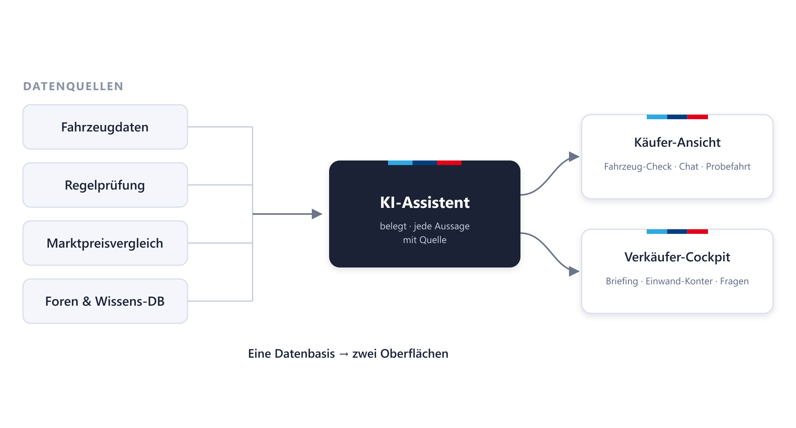
</p>

Jede Aussage steht auf Daten: Eine **Regel-Engine** prüft die Fahrzeugdaten, erkennt
Auffälligkeiten und liefert die Quelle; die **KI** formuliert daraus verständliche Antworten.
So kann nichts „erfunden" werden — jeder Satz ist auf eine Quelle zurückführbar.

---

## Rundgang durch das Mockup

### Käufer-Seite

**1 · Startseite & Fahrzeugliste**
Alle Fahrzeuge auf einen Blick, mit Filtern nach Preis, Kilometerstand, Baujahr und Kraftstoff.

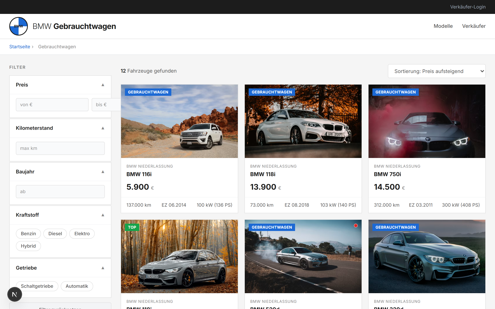

**2 · Fahrzeug-Detailseite**
Ausstattung und technische Daten je Fahrzeug — die Grundlage für eine informierte Entscheidung.

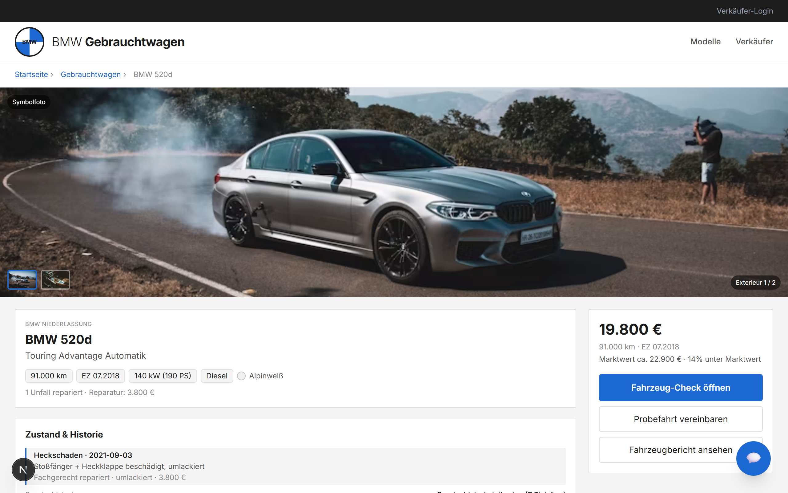

**3 · Fahrzeug-Check — Highlights, Quellen & Garantie**
Ein Klick zeigt alle Besonderheiten des Fahrzeugs (jede mit Quelle), die Schäden im Detail —
und erklärt bei Reparaturkosten-Risiko die passende BMW-Garantie als Lösung.

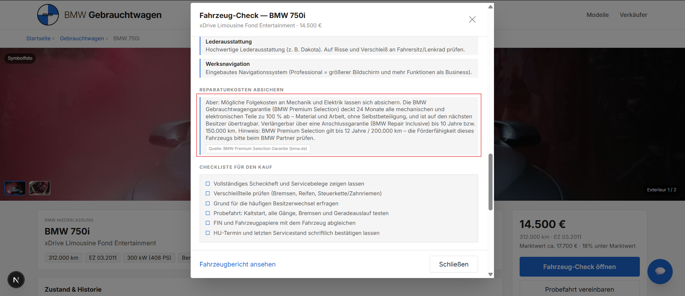

**4 · KI-Chat mit Quellen**
Ehrliche, modellspezifische Antworten zu Motor, Unfall, Kosten, Verhandlung — und zur Frage,
ob eine Reparatur von der BMW Garantie abgedeckt ist. Jede Antwort nennt ihre Grundlage und Quelle.

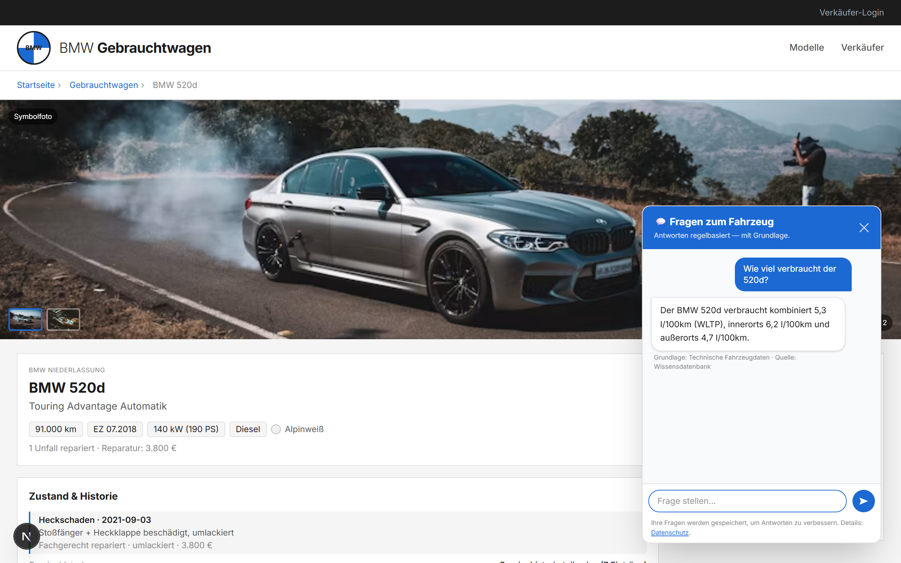

**5 · Probefahrt-Anfrage**
Probefahrt direkt online anfragen — mit transparenter Einwilligung zur Datenspeicherung.

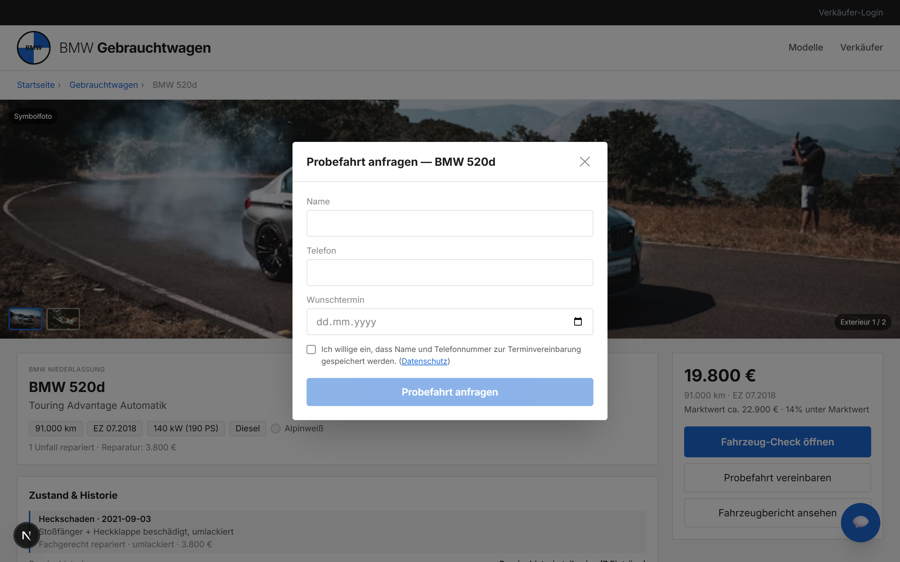

### Verkäufer-Seite

**6 · Dashboard — Übersicht**
Flotten-Kennzahlen auf einen Blick: Durchschnittspreis, Laufleistung, Flottengesundheit,
Kraftstoff- und Abgasmix.

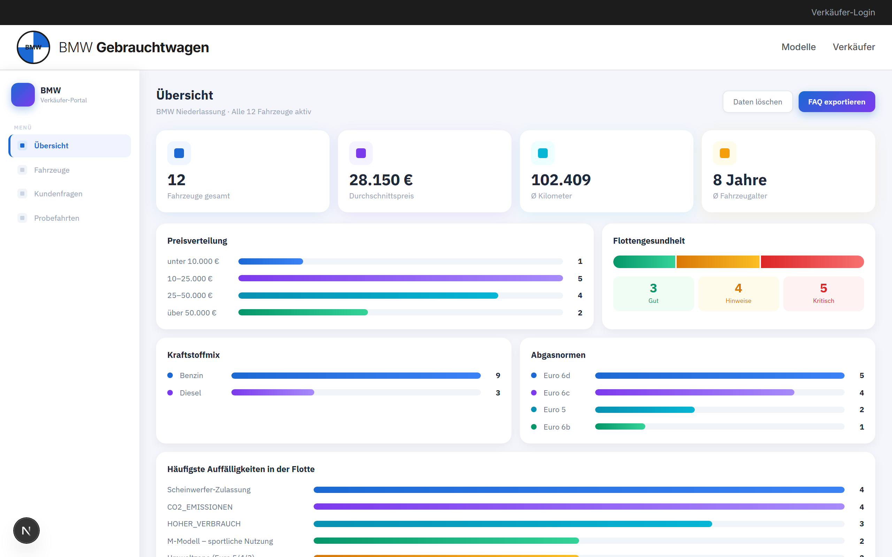

**7 · Fahrzeuge**
Alle Fahrzeuge als Karten mit Status (Gut / Hinweise / Kritisch), Preis und Eckdaten.

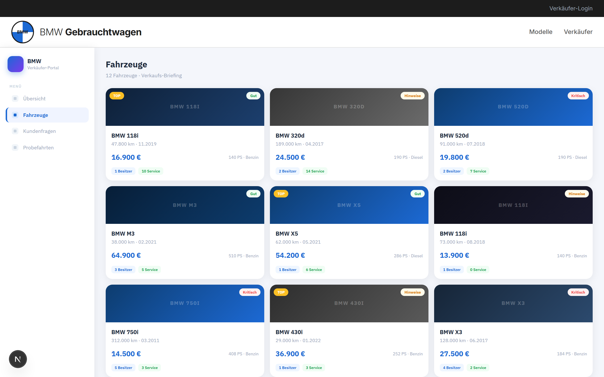

**8 · Fahrzeug-Briefing**
Pro Fahrzeug ein fertiges Verkaufs-Briefing: Verkaufsargumente, Kaufhemmnisse, erwartete und
echte Kundenfragen, Probefahrt-Drehbuch (feste Route) und Ausstattung.

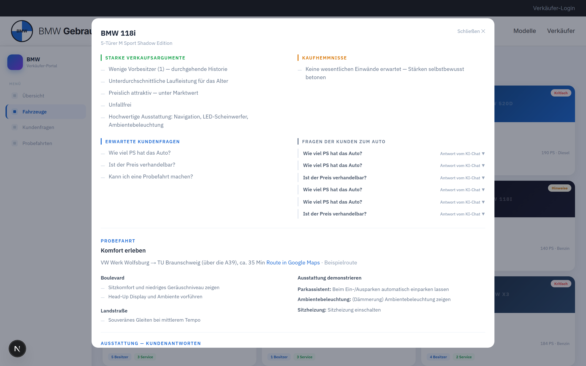

**9 · Kundenfragen**
Welche Fragen Kunden im Chat wirklich stellen — als Ranking und pro Fahrzeug, mit FAQ-Export.

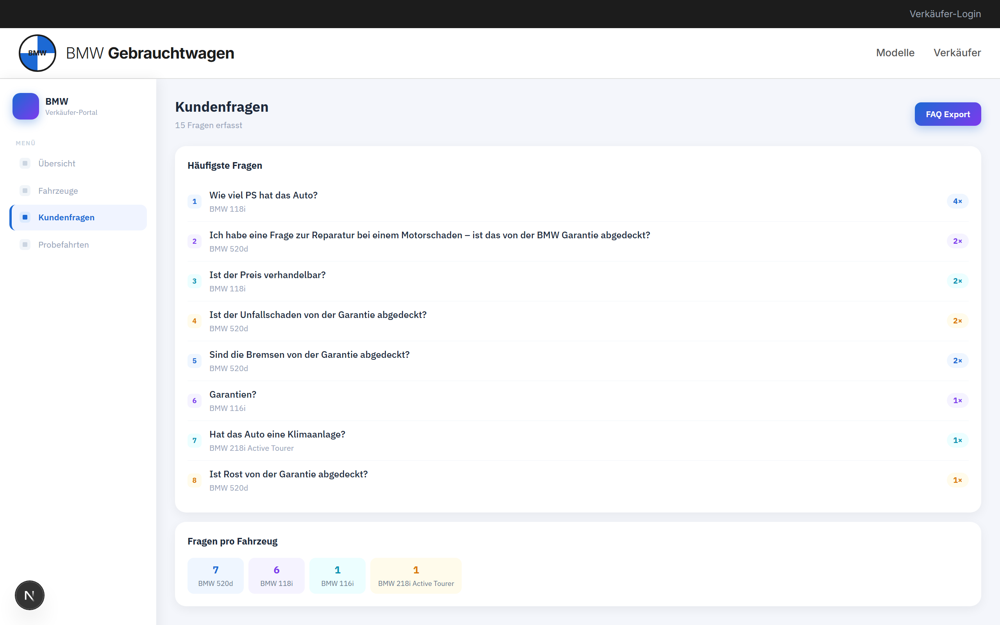

**10 · Probefahrten**
Eingehende Probefahrt-Anfragen mit Kontakt und Wunschtermin.

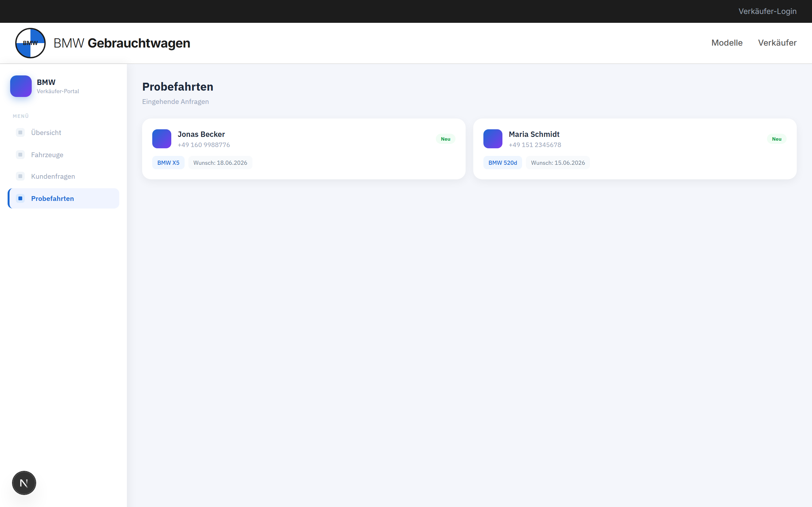

---

## Demo-Videos

Die beiden Aufnahmen zeigen die App in Aktion — einmal aus Sicht des Käufers, einmal aus
Sicht des Verkäufers.

### Käufer-Seite

▶ Aufs Bild klicken zum Abspielen:

[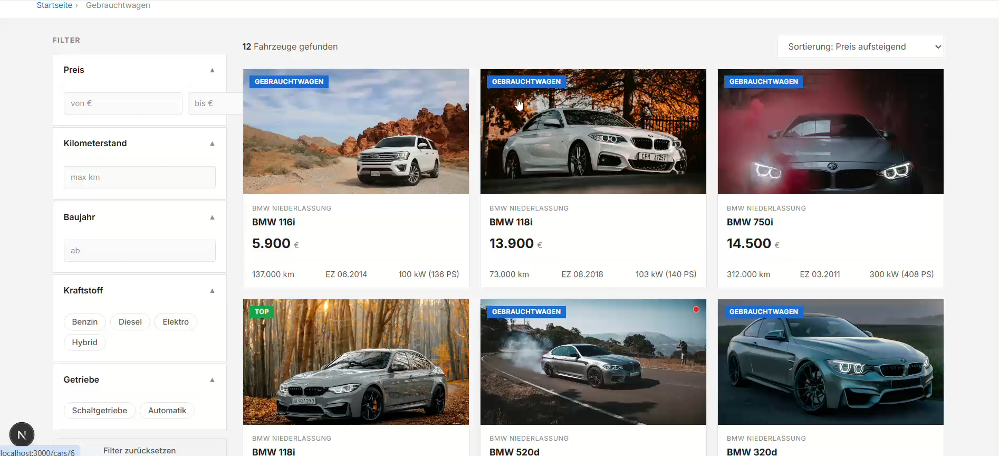](presentation/kaeufer-seite.mp4)

Das Video zeigt den Weg des Käufers durch die OEM-Fahrzeugseite: von der **Fahrzeugliste**
über die **Detailseite** und den **Fahrzeug-Check** (Stärken, Mängel und Schäden — jeweils mit
Quelle, samt BMW-Garantie-Hinweis) bis zum **KI-Chat mit Quellen** und der **Probefahrt-Anfrage**.

### Verkäufer-Seite

▶ Aufs Bild klicken zum Abspielen:

[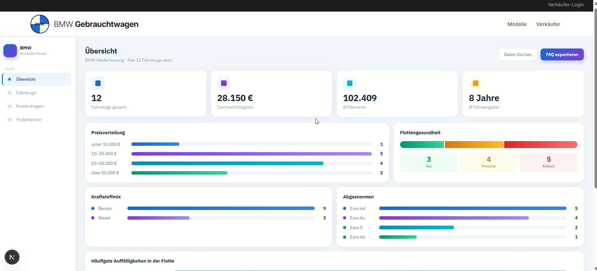](presentation/verkaeufer-seite.mp4)

Das Video zeigt das **Verkäufer-Cockpit**: die **Übersicht** mit Flotten-Kennzahlen
(Durchschnittspreis, Laufleistung, Flottengesundheit), das **Fahrzeug-Briefing** pro Auto
(Verkaufsargumente und Einwand-Konter), die **echten Kundenfragen** aus dem Chat und die
eingehenden **Probefahrt-Anfragen**.

## Schnellstart

```bash
npm install
npm run dev      # http://localhost:3000
```

Optional für Live-KI: `.env.example` nach `.env.local` kopieren und `ANTHROPIC_API_KEY`
eintragen. Ohne Key läuft alles im Demo-Modus.

**Verkäufer-Demo-Login:** `demo@carcheck.de` / `demo123` → `/dashboard`

```bash
npm run build        # Produktions-Build
npm run test:run     # Tests (Vitest) einmalig ausführen
npm run lint         # ESLint
```

## Architektur (Kurz)

- `app/` — Routen (App Router): `app/*/page.tsx` Seiten, `app/api/*/route.ts` HTTP-Handler.
- `components/` — React-Komponenten (Fahrzeug-Check, Chat, Dashboard, Charts …).
- `lib/cars/` — Domänenlogik: Regel-Engine, Anomalie-Erkennung, Preisrechner,
  Schaden-DB, Verkaufs-Intelligenz, BMW-Garantie-Hinweis.
- `lib/ai/` — Claude-Client + deterministische Demo-Fallbacks.
- `lib/auth/` — JWT-Login für Verkäufer.
- `data/cars.json` — Fahrzeug-Datensatz.

Details und Konventionen: siehe [`CLAUDE.md`](CLAUDE.md).

## Hinweis zur KI-Unterstützung

Dieses Repository ist Teil eines Projektes für **Unternehmensethik**. Das Mockup — also
**Code und Oberfläche** — wurde mit Unterstützung von **Claude**, dem KI-Assistenten von
Anthropic, erstellt. Die KI diente dabei als Werkzeug für Implementierung und Design;
Konzept, fachliche Entscheidungen und Inhalte wurden von der Autorin geprüft und verantwortet.
